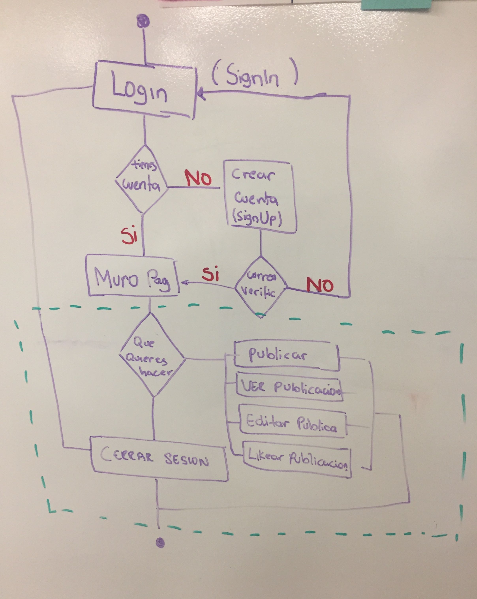

# Creando una Red Social

## Índice

* [Introducción](#introducción)
* [Definición del producto](#definicion-del-producto)
* [Entrevistas](#entrevistas)
* [Historias de usuario](#historias-de-usuario)
* [Diseño de la Interfaz de Usuario](#diseño-interfaz-de-usuario)
+ [Testeo de usabilidad](#testeo-de-usabilidad)
* [Prototipo](#prototipo)

## Introducción

Ayni es la primera red social peruana que busca unir emprendedores, colaboradores y voluntarios para potenciar el alcance de sus proyectos de manera gratuita.

En Ayni podras publicar contenido de interés para la comunidad, podrás conocer los proyectos de emprendimiento con valor social más relevantes de nuestro país.

## Definición del producto

### Principales funcionalidades del producto
* Con nuestra aplicación podras ver las publicaciones de los demás.
* Podrás reaccionar con un "aplauso" a las publicaciones que más valor tengan para ti.
* Tendrás la opción de escoger la privacidad cuando publicas en el muro.
* Podrás editar, eliminar tu publicación.
* Tendrás la opción de poder filtrar tus publicaciones por privados o públicos.

### Principales usuarios

Ayni esta dirigida a todos los emprendedores peruanos,  personas que deseen emprender, colaboradores que deseen ser parte de alguno de los proyectos innovadores.

## Entrevistas

NOMBRE: Homar Lozano
EDAD: 28 años
OCUPACIÓN: Ingeniero de Minas
EMPRENDIMIENTO SOCIAL: Ise -HABI es un programa que desarrolla competencias para jovenes en zonas rurales.

- ¿Qué problemas frecuentes encuentras en tu día a día como dueño del emprendimiento social?              
"Uno de los problemas es el voluntariado y encontrar personas comprometidas con el proyecto , pero además mostrar una proyección de  impacto medible el cuál nos ayudará a conseguir el financiamiento."     
    
                                
- ¿Crees que te hubiera sido de ayuda tener una red social cuando iniciabas con la creacion de tu proyecto? Por que?      
"Sí , el tema de visibilidad por financiamiento es muy valioso , también ayuda a la recaudación y publicidad de lo que se está implementando además que a los menos visibles , darles más pantalla"                                
                                              
- ¿Qué ideas vienen a ti cuando hablamos de una red social para emprendedores sociales?                                
"Espacio de conexión entre muchas personas con cierta diversidad de impacto por razón social.
Vinculación con personas realmente interesadas,
Medir con apoyo.

Ayni esta dirigida a todos los emprendedores peruanos,  personas que deseen emprender, colaboradores que deseen ser parte de alguno de los proyectos innovadores.

### Cómo descubriste las necesidades de los usuarios
En la actualidad existen redes sociales enfocadas a emprendedores pero para ser parte de este grupo es necesario pagar una menbresía y además no están enfocadas a la realidad de nuestro país, es por esto que vimos la necesidad que tienen muchos peruanos que en muchos casos tienen el deseo de emprender pero no cuentan con los conocimientos o no conocen a personas involucradas en emprendimiento.

## Historias de usuario

* Yo como usuario quiero hacer publicaciones, editarlas y guardarlas para compartir información con los demas.
* Yo como usuario quiero darle me gusta a las publicaciones y ver cuantos me gustan hay.
* Yo como usuario quiero poder decidir con quien comparto mis publicaciones para controlar mi privacidad.
* Yo como usuario quiero diferenciar entre mis publicaciones públicas y privadas para poder ver de una manera más ordenadas mis publicaciones.
* Como usuario me gustaría poder ver la fecha de creación de las publicaciones para poder saber cuanto tiempo ha transcurrido desde que fue creado la publicación.
* Yo como usuario quiero poder ver mi nombre y foto en cada publicación para distinguir cuales son mias.
* Yo como usuario quiero poder iniciar sesion con otras redes sociales para tener una forma más rápida de iniciar sesión.

## Diseño de la Interfaz de Usuario 

Diagrama de flujo del funcionamiento de la Red Social "Ayni"

## Testeo de usabilidad
Inicialmente creamos el siguiente prototipo, el cual fue variando debido a las recomendaciones de nuestros usuarios. 

- Prototipo Desktop

## Prototipo
- Prototipo Final de Baja fidelidad (mobile first) :
 Inicio de sesión:

Muro:

- Prototipo Final de Baja fidelidad( desktop version)

## Diseño de la Interfaz de Usuario 

Diagrama de flujo del funcionamiento de la Red Social "Ayni"

